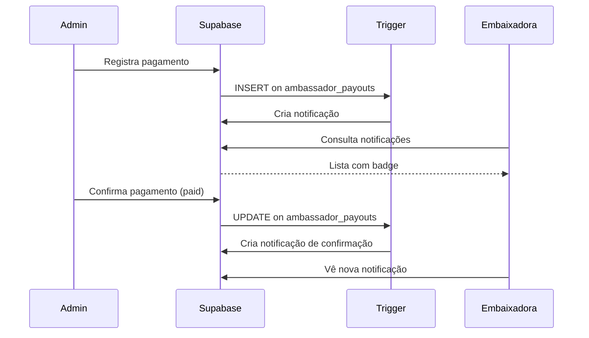

# Fase 5.1 - Sistema de Registro de Pagamentos e Notificações

## Visão Geral

Esta fase adiciona um sistema completo de registro de pagamentos para embaixadoras, incluindo:
- Formulário de registro de pagamentos (manual e baseado em comissões pendentes)
- Sistema de notificações in-app para embaixadoras
- Notificações automáticas via triggers no banco de dados

## Estrutura Implementada

### Banco de Dados

#### Tabela: `ambassador_notifications`
```sql
- id: UUID (PK)
- ambassador_id: UUID (FK -> ambassadors)
- type: TEXT ('payment_registered', 'payment_confirmed', 'commission_earned')
- title: TEXT
- message: TEXT
- metadata: JSONB
- read: BOOLEAN
- read_at: TIMESTAMP
- created_at: TIMESTAMP
```

#### Trigger: `trigger_notify_ambassador_payment`
Dispara automaticamente quando:
- Pagamento é registrado (status = 'pending')
- Pagamento é confirmado (status = 'paid')

### Componentes

#### Admin: `CreatePayoutDialog`
- **Localização**: `src/components/admin/ambassadors/CreatePayoutDialog.tsx`
- **Funcionalidades**:
  - Modo Manual: Preencher todos os dados do pagamento
  - Modo Comissões Pendentes: Criar pagamento a partir de valores pendentes
  - Auto-preenchimento de dados da embaixadora selecionada
  - Validação com Zod

#### Embaixadora: `AmbassadorNotifications`
- **Localização**: `src/components/ambassador/AmbassadorNotifications.tsx`
- **Variantes**:
  - `icon`: Ícone com badge de contagem no header
  - `full`: Card completo para exibição na aba de pagamentos

### Hooks

#### `useAmbassadorNotifications`
- **Localização**: `src/hooks/useAmbassadorNotifications.ts`
- **Funções**:
  - `useNotifications(ambassadorId)`: Lista notificações
  - `useUnreadCount(ambassadorId)`: Conta não lidas (atualiza a cada 30s)
  - `useMarkAsRead()`: Marca como lida
  - `useMarkAllAsRead()`: Marca todas como lidas

## Fluxo de Notificações



## Políticas RLS

- Embaixadoras podem ver e atualizar suas próprias notificações
- Admins podem gerenciar todas as notificações

## Uso

### Registrar Pagamento (Admin)

1. Acesse `/admin/embaixadoras`
2. Vá para a aba "Pagamentos"
3. Clique em "Novo Pagamento"
4. Escolha o modo:
   - **Manual**: Preencha todos os campos
   - **Comissões Pendentes**: Selecione embaixadora com saldo

### Ver Notificações (Embaixadora)

1. Acesse `/painel/embaixadora`
2. Clique no ícone de sino no header (mostra badge com contagem)
3. Ou vá para aba "Pagamentos" para ver lista completa

## Status do Pagamento

- **Pendente**: Pagamento registrado, aguardando processamento
- **Pago**: Pagamento confirmado

## Próximos Passos

✅ **Fase 6 Implementada** - Ver `06-fase6-integracao-emails-mailrelay.md`

- ✅ Edge function `send-ambassador-payout-email` criada
- ✅ Trigger automático para disparo de emails
- ✅ Template HTML responsivo para confirmação de pagamento
- ✅ Integração com Mailrelay API
