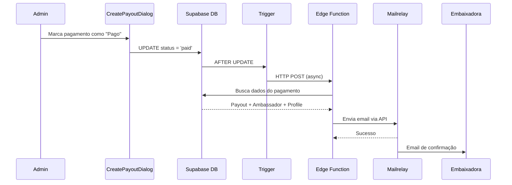

# Fase 6 - Integração com Envio de Emails via Mailrelay

## Visão Geral

Esta fase adiciona o envio automático de emails de confirmação de pagamento para embaixadoras, integrando com o sistema Mailrelay já utilizado no projeto.

## Estrutura Implementada

### Edge Function: `send-ambassador-payout-email`

**Localização:** `supabase/functions/send-ambassador-payout-email/index.ts`

**Funcionalidades:**
- Recebe `payout_id` como parâmetro
- Busca dados do pagamento, embaixadora e perfil
- Gera email HTML responsivo com template profissional
- Envia via Mailrelay API

**Endpoint:**
```
POST https://ngqymbjatenxztrjjdxa.supabase.co/functions/v1/send-ambassador-payout-email
```

**Payload:**
```json
{
  "payout_id": "uuid-do-pagamento",
  "action": "paid"
}
```

### Trigger Automático

**Função:** `public.send_ambassador_payout_email()`

**Trigger:** `trigger_send_ambassador_payout_email`

**Comportamento:**
- Dispara automaticamente quando `status` muda para `'paid'`
- Utiliza `pg_net` para chamada HTTP assíncrona
- Não bloqueia a transação em caso de erro

### Template de Email

O email de confirmação inclui:

1. **Header** com gradiente roxo e ícone 💰
2. **Saudação** personalizada com nome da embaixadora
3. **Card de detalhes** com:
   - Período de referência (ex: "Janeiro de 2026")
   - Número de vendas no período
   - Valor bruto
   - Valor líquido (pago)
   - Método de pagamento
   - Data do pagamento
   - Observações (se houver)
4. **Botão CTA** "Ver Meu Painel"
5. **Mensagem de agradecimento**
6. **Footer** com copyright

### Secrets Utilizados

Os seguintes secrets já estão configurados no projeto:
- `MAILRELAY_API_KEY` - Chave de API do Mailrelay
- `MAILRELAY_HOST` - Host da API (ex: `mec.ipzmarketing.com`)
- `ADMIN_EMAIL_FROM` - Email remetente

## Fluxo Completo



## Logs e Monitoramento

Os logs da edge function podem ser acessados em:
- Supabase Dashboard > Edge Functions > send-ambassador-payout-email > Logs

Exemplo de logs:
```
[SEND-AMBASSADOR-PAYOUT-EMAIL] Processing payout email request - {"payout_id":"...","action":"paid"}
[SEND-AMBASSADOR-PAYOUT-EMAIL] Found payout data - {"ambassadorName":"Maria Silva","email":"maria@email.com","amount":150}
[SEND-AMBASSADOR-PAYOUT-EMAIL] Sending email via Mailrelay - {"to":"maria@email.com","subject":"💰 Pagamento Confirmado - Janeiro de 2026"}
[SEND-AMBASSADOR-PAYOUT-EMAIL] Email sent successfully
```

## Configuração no Config.toml

```toml
[functions.send-ambassador-payout-email]
verify_jwt = false
```

## Testes

Para testar manualmente via cURL:

```bash
curl -X POST \
  'https://ngqymbjatenxztrjjdxa.supabase.co/functions/v1/send-ambassador-payout-email' \
  -H 'Content-Type: application/json' \
  -d '{"payout_id": "ID_DO_PAGAMENTO", "action": "paid"}'
```

## Próximos Passos (Opcional)

- [ ] Adicionar email de registro pendente (quando pagamento é criado)
- [ ] Template de resumo mensal de comissões
- [ ] Configurações de preferência de email por embaixadora
- [ ] Integração com histórico de emails enviados
