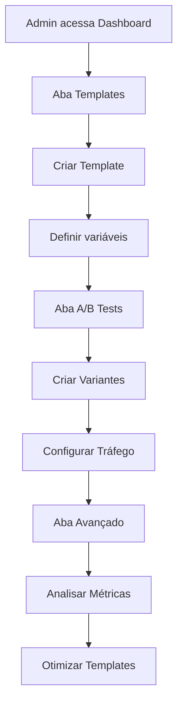

# Fase 3: Melhorias de Baixa Prioridade - Analytics Avançado, Templates e A/B Testing

## 📋 Visão Geral

Esta fase implementa funcionalidades avançadas para otimizar a comunicação com usuários e análise de performance da jornada do cliente.

## 🎯 Funcionalidades Implementadas

### 1. **Templates de Email Personalizados**

Sistema completo para criar e gerenciar templates de email com variáveis dinâmicas.

#### Tabela: `email_templates`
```sql
CREATE TABLE public.email_templates (
  id UUID PRIMARY KEY,
  name TEXT NOT NULL,
  subject TEXT NOT NULL,
  html_content TEXT NOT NULL,
  text_content TEXT,
  journey_stage TEXT NOT NULL,
  variables JSONB DEFAULT '[]',
  is_active BOOLEAN DEFAULT true,
  created_by UUID REFERENCES auth.users(id),
  created_at TIMESTAMPTZ DEFAULT now(),
  updated_at TIMESTAMPTZ DEFAULT now()
);
```

#### Variáveis Disponíveis
- `{{user_name}}` - Nome do usuário
- `{{user_email}}` - Email do usuário
- `{{stage_name}}` - Nome do estágio atual
- `{{action_url}}` - URL de ação específica
- `{{support_email}}` - Email de suporte

#### Componente: `EmailTemplateManager`
- Criar/editar/excluir templates
- Preview de templates com variáveis substituídas
- Ativar/desativar templates
- Filtro por estágio da jornada

### 2. **Sistema de A/B Testing**

Teste diferentes variantes de emails para otimizar performance.

#### Tabela: `email_ab_variants`
```sql
CREATE TABLE public.email_ab_variants (
  id UUID PRIMARY KEY,
  template_id UUID REFERENCES email_templates(id),
  variant_name TEXT NOT NULL,
  subject TEXT NOT NULL,
  html_content TEXT NOT NULL,
  text_content TEXT,
  traffic_percentage INTEGER,
  is_active BOOLEAN DEFAULT true
);
```

#### Tabela: `email_sends`
Rastreia envios e ações dos usuários:
```sql
CREATE TABLE public.email_sends (
  id UUID PRIMARY KEY,
  user_id UUID REFERENCES auth.users(id),
  template_id UUID,
  variant_id UUID,
  journey_stage TEXT,
  sent_at TIMESTAMPTZ,
  opened_at TIMESTAMPTZ,
  clicked_at TIMESTAMPTZ,
  converted_at TIMESTAMPTZ
);
```

#### Função: `get_ab_test_metrics()`
Retorna métricas comparativas:
- Total de envios
- Taxa de abertura (open rate)
- Taxa de cliques (click rate)
- Taxa de conversão (conversion rate)

#### Componente: `ABTestManager`
- Criar variantes de templates
- Configurar distribuição de tráfego
- Visualizar métricas comparativas
- Identificar variantes vencedoras

### 3. **Analytics Avançado**

Análise detalhada com visualizações temporais e métricas agregadas.

#### Tabela: `journey_analytics_daily`
Métricas agregadas por dia:
```sql
CREATE TABLE public.journey_analytics_daily (
  id UUID PRIMARY KEY,
  date DATE NOT NULL,
  journey_stage TEXT NOT NULL,
  users_entered INTEGER,
  users_completed INTEGER,
  users_abandoned INTEGER,
  avg_time_in_stage_hours NUMERIC(10,2),
  conversion_rate NUMERIC(5,2)
);
```

#### Função: `get_advanced_journey_analytics()`
```sql
get_advanced_journey_analytics(
  p_start_date DATE DEFAULT CURRENT_DATE - 30,
  p_end_date DATE DEFAULT CURRENT_DATE
)
```

Retorna:
- Usuários que entraram no estágio
- Usuários que completaram
- Usuários que abandonaram
- Taxa de conversão
- Tempo médio no estágio

#### Componente: `AdvancedAnalytics`

**Métricas Resumidas:**
- Total de usuários entraram
- Total completaram
- Total abandonaram
- Taxa de conversão média
- Tempo médio por estágio

**Visualizações:**
- Gráfico de linha: Tendência temporal de usuários
- Gráfico de barras: Taxa de conversão por estágio
- Filtros por período (7, 30, 90 dias)
- Filtros por estágio específico

## 🎨 Interface do Usuário

### Dashboard de Jornada - Novas Abas

1. **Templates** - Gerenciar templates de email
2. **A/B Tests** - Configurar e analisar testes
3. **Avançado** - Analytics com visualizações detalhadas

### Fluxo de Uso



## 📊 Métricas Rastreadas

### Email Performance
- **Envios** - Total de emails enviados
- **Aberturas** - Quantos emails foram abertos
- **Cliques** - Quantos links foram clicados
- **Conversões** - Quantos completaram a ação desejada

### Journey Performance
- **Entradas** - Usuários que entraram no estágio
- **Completados** - Usuários que finalizaram o estágio
- **Abandonos** - Usuários que saíram sem completar
- **Tempo Médio** - Quanto tempo ficaram no estágio
- **Taxa de Conversão** - Porcentagem que avançou

## 🔒 Segurança

### Row Level Security (RLS)

Todas as tabelas possuem RLS habilitado:

```sql
-- Apenas admins podem gerenciar templates
CREATE POLICY "Admins can manage email templates"
  ON email_templates
  FOR ALL
  USING (has_role(auth.uid(), 'admin'));

-- Edge functions podem inserir envios
CREATE POLICY "Edge functions can insert email sends"
  ON email_sends
  FOR INSERT
  WITH CHECK (true);
```

## 🚀 Como Usar

### 1. Criar Template de Email

```typescript
// Via interface
1. Acesse Dashboard → Aba "Templates"
2. Clique em "Novo Template"
3. Preencha os campos:
   - Nome: "Boas-vindas pós-cadastro"
   - Estágio: "signup"
   - Assunto: "Bem-vindo, {{user_name}}!"
   - Conteúdo HTML: Use variáveis dinâmicas
4. Clique em "Criar Template"
```

### 2. Configurar A/B Test

```typescript
// Via interface
1. Acesse Dashboard → Aba "A/B Tests"
2. Clique em "Nova Variante"
3. Selecione template base
4. Configure:
   - Nome da Variante: "B"
   - Tráfego: 50%
   - Assunto alternativo
   - Conteúdo alternativo
5. Clique em "Criar Variante"
```

### 3. Analisar Performance

```typescript
// Via interface
1. Acesse Dashboard → Aba "Avançado"
2. Selecione período (7/30/90 dias)
3. Filtre por estágio específico
4. Analise gráficos e métricas
5. Exporte relatórios (futuro)
```

### 4. Usar Template em Edge Function

```typescript
// Em send-journey-reminder ou similar
const { data: template } = await supabase
  .from('email_templates')
  .select('*')
  .eq('journey_stage', stage)
  .eq('is_active', true)
  .single();

// Substituir variáveis
let content = template.html_content
  .replace(/\{\{user_name\}\}/g, userName)
  .replace(/\{\{user_email\}\}/g, userEmail)
  .replace(/\{\{stage_name\}\}/g, stageName);

// Registrar envio
await supabase
  .from('email_sends')
  .insert({
    user_id: userId,
    template_id: template.id,
    journey_stage: stage,
    subject: template.subject
  });
```

## 📈 Próximas Melhorias Sugeridas

### Fase 4 (Futura)
1. **Automação de Testes**
   - Encerrar testes automaticamente após significância estatística
   - Ativar variante vencedora automaticamente
   - Notificar admins sobre resultados

2. **Editor Visual de Templates**
   - Drag & drop de blocos
   - Biblioteca de componentes reutilizáveis
   - Preview em tempo real
   - Testes de responsividade

3. **Exportação de Relatórios**
   - PDF com gráficos
   - CSV com dados brutos
   - Agendamento de relatórios
   - Envio por email

4. **Segmentação Avançada**
   - Filtros por características de usuário
   - Testes por segmento
   - Personalização por segmento

5. **Otimização por IA**
   - Sugestões de melhorias em templates
   - Previsão de performance
   - Geração automática de variantes

## 🧪 Testes

### Testar Criação de Template

```sql
-- Inserir template de teste
INSERT INTO email_templates (
  name,
  subject,
  html_content,
  journey_stage,
  is_active
) VALUES (
  'Teste Boas-vindas',
  'Olá {{user_name}}!',
  '<h1>Bem-vindo!</h1><p>Olá {{user_name}}, seu email é {{user_email}}</p>',
  'signup',
  true
);
```

### Testar A/B Testing

```sql
-- Criar variante
INSERT INTO email_ab_variants (
  template_id,
  variant_name,
  subject,
  html_content,
  traffic_percentage
) VALUES (
  '<template_id>',
  'B',
  'Olá {{user_name}}, teste variante B',
  '<h1>Variante B</h1>',
  50
);

-- Ver métricas
SELECT * FROM get_ab_test_metrics(NULL, 30);
```

### Testar Analytics

```sql
-- Ver analytics avançado
SELECT * FROM get_advanced_journey_analytics(
  CURRENT_DATE - 30,
  CURRENT_DATE
);
```

## 📚 Documentação Relacionada

- [Fase 1: Notificações de Novos Usuários](./fase1-notificacoes-implementacao.md)
- [Fase 2: Dashboard de Jornada do Cliente](./fase2-jornada-cliente-implementacao.md)
- [Edge Function: send-journey-reminder](../supabase/functions/send-journey-reminder/index.ts)

## 🎯 KPIs Importantes

### Para Templates
- Taxa de abertura > 20%
- Taxa de cliques > 3%
- Taxa de conversão > 5%

### Para A/B Tests
- Significância estatística (p-value < 0.05)
- Tamanho mínimo de amostra: 100 envios por variante
- Diferença mínima detectável: 10% de melhoria

### Para Jornada
- Taxa de conversão signup → active > 30%
- Tempo médio signup → active < 48 horas
- Taxa de abandono < 40% em cada estágio

## ✅ Status da Implementação

- ✅ Tabelas criadas com RLS
- ✅ Funções SQL implementadas
- ✅ Componente EmailTemplateManager
- ✅ Componente ABTestManager
- ✅ Componente AdvancedAnalytics
- ✅ Integração com Dashboard
- ⏳ Documentação de uso para edge functions
- ⏳ Testes automatizados
- ⏳ Otimizações de performance

---

**Implementado em**: 13/10/2025  
**Versão**: 1.0  
**Responsável**: Sistema de Jornada do Cliente
