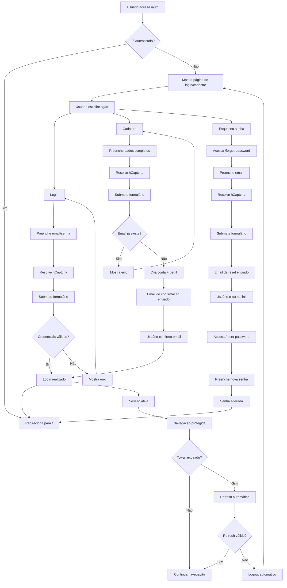

# Fluxo de Autenticação - Mulheres em Convergência

Este documento descreve o fluxo completo de autenticação implementado no portal, incluindo cadastro, login, recuperação de senha e segurança.

## Diagrama do Fluxo de Autenticação

<mermaid>

</mermaid>

## Componentes do Sistema

### 1. Páginas de Autenticação

- **`/auth`**: Página principal com tabs para login e cadastro
- **`/forgot-password`**: Solicitação de recuperação de senha
- **`/reset-password`**: Redefinição de senha via link do email

### 2. Hook useAuth

Gerencia todo o estado de autenticação:

```typescript
const {
  user,              // Dados do usuário atual
  session,           // Sessão ativa do Supabase
  loading,           // Estado de carregamento
  signIn,            // Função de login
  signUp,            // Função de cadastro
  signOut,           // Função de logout
  isAdmin,           // Verifica se é admin
  canEditBlog,       // Verifica permissão de edição do blog
  requestPasswordReset,  // Solicita reset de senha
  updatePassword     // Atualiza senha
} = useAuth();
```

### 3. Componente ProtectedRoute

Protege rotas que requerem autenticação:

```typescript
<ProtectedRoute requireAdmin={true}>
  <AdminPanel />
</ProtectedRoute>

<ProtectedRoute requireBlogEditor={true}>
  <BlogEditor />
</ProtectedRoute>
```

## Segurança Implementada

### hCaptcha
- Proteção contra bots em login, cadastro e recuperação de senha
- Site key de produção: `923efbe4-6b78-4ede-84c4-a830848abf32`
- Integração completa com validação no frontend

### Row Level Security (RLS)
- Políticas de acesso por usuário nas tabelas `profiles`
- Separação de dados por usuário logado
- Proteção contra acesso não autorizado

### Gestão de Tokens
- JWT com refresh automático
- Armazenamento seguro no localStorage
- Logout automático em caso de token inválido

### Validações
- Email format validation
- Força de senha (mínimo 6 caracteres)
- Sanitização de inputs
- Proteção CSRF via tokens

## Fluxo de Dados

### Login Bem-sucedido
1. Usuário submete credenciais + captcha
2. Supabase valida credenciais
3. Retorna session com access_token e refresh_token
4. `onAuthStateChange` atualiza estado global
5. Busca dados do perfil do usuário
6. Redireciona para página inicial

### Cadastro Bem-sucedido
1. Usuário submete dados + captcha
2. Supabase cria conta na tabela `auth.users`
3. Trigger automático cria registro na tabela `profiles`
4. Email de confirmação enviado
5. Usuário confirma email
6. Conta ativada e login automático

### Recuperação de Senha
1. Usuário informa email + captcha
2. Supabase envia email com link de reset
3. Link redireciona para `/reset-password` com token
4. Usuário informa nova senha
5. Senha atualizada no banco
6. Redireciona para `/auth`

## Estados da Aplicação

### Loading States
- `loading: true` durante inicialização
- Skeleton/spinner durante operações
- Botões desabilitados durante submissão

### Error Handling
- Toasts para feedback de erros
- Mensagens específicas por tipo de erro
- Fallback para erros não mapeados

### Success States
- Confirmações visuais de sucesso
- Redirecionamento automático
- Reset de formulários

## Configurações Necessárias

### Supabase Auth Settings
- Email templates customizados
- Redirect URLs configurados
- hCaptcha site key e secret key
- SMTP configurado (opcional)

### Variáveis de Ambiente
```bash
SUPABASE_URL=https://ngqymbjatenxztrjjdxa.supabase.co
SUPABASE_ANON_KEY=eyJhbGciOiJIUzI1NiIsInR5cCI6IkpXVCJ9...
```

## Monitoramento e Logs

### Logs de Autenticação
- Login/logout events
- Failed authentication attempts
- Password reset requests
- Account creation events

### Métricas Importantes
- Taxa de conversão de cadastro
- Tempo de sessão médio
- Tentativas de login falhadas
- Uso de recuperação de senha

## Manutenção e Troubleshooting

### Problemas Comuns

1. **hCaptcha não funciona**
   - Verificar site key/secret key no Supabase
   - Confirmar domínio na allowlist do hCaptcha

2. **Emails não chegam**
   - Verificar configuração SMTP
   - Confirmar templates de email
   - Verificar spam/lixo eletrônico

3. **Sessão expira rapidamente**
   - Verificar configuração de JWT no Supabase
   - Implementar refresh token automático

4. **Redirect loops**
   - Verificar URLs de redirect configurados
   - Validar lógica de proteção de rotas

### Comandos Úteis para Debug

```typescript
// Verificar estado atual da auth
console.log(supabase.auth.getSession());

// Forçar logout
supabase.auth.signOut();

// Verificar dados do usuário
console.log(supabase.auth.getUser());
```

## Próximos Passos

### Melhorias Planejadas
- [ ] Two-factor authentication (2FA)
- [ ] Social login (Google, Facebook)
- [ ] Login sem senha (magic links)
- [ ] Auditoria de sessões ativas
- [ ] Dispositivos confiáveis
- [ ] Rate limiting aprimorado

### Integrações Futuras
- [ ] Single Sign-On (SSO)
- [ ] Integração com CRM
- [ ] Analytics de comportamento
- [ ] Notificações push