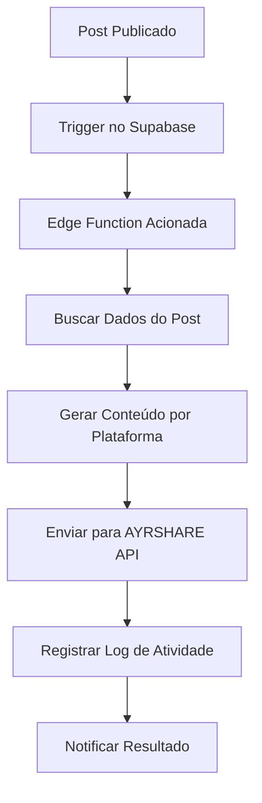

# Integração AYRSHARE - Auto-Post para Redes Sociais

## Visão Geral

Integração completa com a plataforma AYRSHARE para distribuição automática de posts do blog nas redes sociais, permitindo alcance ampliado e engajamento consistente do conteúdo.

## Sobre AYRSHARE

**AYRSHARE** é uma API unificada que permite gerenciar presença em redes sociais através de uma única integração, suportando 13+ plataformas sociais principais.

### Vantagens
- ✅ **API Única**: Uma integração para múltiplas redes
- ✅ **Scheduling**: Agendamento de posts
- ✅ **Analytics**: Métricas de performance
- ✅ **Media Support**: Imagens e vídeos
- ✅ **Reliability**: 99.9% uptime garantido

### Plataformas Suportadas
- Facebook (Pages & Groups)
- LinkedIn (Personal & Company)
- Twitter/X
- Instagram (Business)
- YouTube (Community posts)
- TikTok, Pinterest, Reddit e outras

## Implementação Técnica

### Edge Function Principal

**Arquivo:** `supabase/functions/ayrshare-auto-post/index.ts`

**Funcionalidade:**
- Recebe ID do post publicado
- Busca dados completos do post no Supabase
- Gera conteúdo personalizado por plataforma
- Envia para AYRSHARE API
- Registra logs de atividade

### Configuração de Segurança

**Secret necessária:**
```
AYRSHARE_API_KEY = "sua_chave_api_ayrshare"
```

**Configuração no Supabase:**
- Secret adicionada via painel de secrets
- Disponível nas edge functions
- Criptografia automática

### Fluxo de Funcionamento



## Geração de Conteúdo Personalizado

### Template Base
```typescript
const generatePostContent = (platform: string) => {
  const hashtags = '#MulheresEmConvergencia #Empreendedorismo #MulheresEmpreendedoras #BlogConvergindo';
  
  switch (platform) {
    case 'facebook':
      return `🌟 Novo post no Blog Convergindo!
${postTitle}
${postExcerpt}
${categoryName ? `📂 Categoria: ${categoryName}` : ''}
✍️ Por: ${authorName}
Leia o post completo: ${postUrl}
${hashtags}`;
    // ... outros casos
  }
};
```

### Personalização por Plataforma

#### Facebook
```
🌟 Novo post no Blog Convergindo!

[Título do Post]

[Excerpt/Resumo]

📂 Categoria: [Nome da Categoria]
✍️ Por: [Nome do Autor]

Leia o post completo: [URL com UTMs]

#MulheresEmConvergencia #Empreendedorismo #MulheresEmpreendedoras #BlogConvergindo
```

#### LinkedIn
```
🚀 Novo artigo publicado no Blog Convergindo

[Título do Post]

[Excerpt/Resumo]

Este conteúdo foi criado para inspirar e empoderar mulheres empreendedoras em sua jornada de crescimento.

#[Categoria] #MulheresEmConvergencia #Empreendedorismo

Leia mais: [URL com UTMs]
```

#### Twitter/X
```
✨ [Título do Post]

[Excerpt truncado se necessário]

[URL com UTMs]

#MulheresEmConvergencia #Empreendedorismo
```

#### Instagram
```
🌟 [Título do Post]

[Excerpt/Resumo]

📂 [Categoria]
✍️ [Autor]

Link no nosso perfil! 👆

#MulheresEmConvergencia #Empreendedorismo #MulheresEmpreendedoras
```

## Configuração da API

### Payload para AYRSHARE
```typescript
const ayrshareData: AyrsharePostData = {
  post: generatePostContent('default'), // Conteúdo padrão
  platforms: ['facebook', 'linkedin', 'twitter'], // Plataformas ativas
  media_urls: mediaUrls, // Imagem destacada se disponível
  // Scheduled posting (opcional)
  // scheduled_date: new Date(Date.now() + 5 * 60 * 1000).toISOString()
};

// Conteúdo específico por plataforma
const platformSpecificData = {
  ...ayrshareData,
  facebookOptions: {
    post: generatePostContent('facebook')
  },
  linkedInOptions: {
    post: generatePostContent('linkedin')
  },
  twitterOptions: {
    post: generatePostContent('twitter')
  },
  instagramOptions: {
    post: generatePostContent('instagram')
  }
};
```

### Headers da Requisição
```typescript
const ayrshareResponse = await fetch('https://app.ayrshare.com/api/post', {
  method: 'POST',
  headers: {
    'Content-Type': 'application/json',
    'Authorization': `Bearer ${ayrshareApiKey}`,
  },
  body: JSON.stringify(platformSpecificData),
});
```

## Trigger Automático

### Database Trigger (Futuro)
```sql
-- Trigger para auto-post quando status muda para 'published'
CREATE OR REPLACE FUNCTION notify_post_published()
RETURNS TRIGGER AS $$
BEGIN
  IF NEW.status = 'published' AND OLD.status != 'published' THEN
    -- Chamar edge function
    PERFORM net.http_post(
      url := 'https://ngqymbjatenxztrjjdxa.supabase.co/functions/v1/ayrshare-auto-post',
      headers := '{"Content-Type": "application/json", "Authorization": "Bearer [ANON_KEY]"}'::jsonb,
      body := jsonb_build_object('postId', NEW.id)
    );
  END IF;
  RETURN NEW;
END;
$$ LANGUAGE plpgsql;

CREATE TRIGGER trigger_post_published
  AFTER UPDATE ON blog_posts
  FOR EACH ROW
  EXECUTE FUNCTION notify_post_published();
```

### Manual Trigger (Atual)
```typescript
// No BlogEditor.tsx, após publicação bem-sucedida
if (postData.status === 'published') {
  try {
    await supabase.functions.invoke('ayrshare-auto-post', {
      body: { postId: result.id }
    });
  } catch (error) {
    console.log('Auto-post failed, but post was published successfully');
  }
}
```

## Configuração no Painel Admin

### Interface de Configuração (Futuro)
```typescript
// Seção no Admin.tsx
<Card>
  <CardHeader>
    <CardTitle>Auto-Post Social Media</CardTitle>
    <CardDescription>
      Configurar distribuição automática nas redes sociais
    </CardDescription>
  </CardHeader>
  <CardContent>
    <div className="space-y-4">
      <div className="flex items-center justify-between">
        <Label>Auto-post ativo</Label>
        <Switch checked={autoPostEnabled} />
      </div>
      
      <div className="space-y-2">
        <Label>Plataformas ativas</Label>
        <div className="flex flex-wrap gap-2">
          <Badge variant={platforms.facebook ? "default" : "outline"}>
            Facebook
          </Badge>
          <Badge variant={platforms.linkedin ? "default" : "outline"}>
            LinkedIn
          </Badge>
          <Badge variant={platforms.twitter ? "default" : "outline"}>
            Twitter
          </Badge>
        </div>
      </div>
    </div>
  </CardContent>
</Card>
```

## Logs e Monitoramento

### Activity Log
```typescript
await supabase
  .from('user_activity_log')
  .insert({
    user_id: 'system',
    activity_type: 'blog_auto_posted',
    activity_description: `Post "${postTitle}" automatically shared to social media`,
    metadata: {
      post_id: postId,
      platforms: platforms,
      ayrshare_response: ayrshareResult
    }
  });
```

### Resposta da AYRSHARE
```json
{
  "status": "success",
  "id": "ayr_post_12345",
  "platforms": {
    "facebook": {
      "status": "success",
      "postId": "fb_12345",
      "url": "https://facebook.com/post/12345"
    },
    "linkedin": {
      "status": "success", 
      "postId": "li_67890",
      "url": "https://linkedin.com/post/67890"
    },
    "twitter": {
      "status": "success",
      "postId": "tw_abcde",
      "url": "https://twitter.com/post/abcde"
    }
  }
}
```

## Tratamento de Erros

### Casos de Erro Comuns
1. **API Key inválida**
2. **Contas não conectadas no AYRSHARE**
3. **Limite de posts excedido**
4. **Falha de rede**
5. **Conteúdo rejeitado pela plataforma**

### Estratégia de Retry
```typescript
// Implementação com retry
const maxRetries = 3;
let attempt = 0;

while (attempt < maxRetries) {
  try {
    const response = await fetch(ayrshareUrl, options);
    if (response.ok) break;
    
    attempt++;
    await new Promise(resolve => setTimeout(resolve, 1000 * attempt));
  } catch (error) {
    if (attempt === maxRetries - 1) throw error;
    attempt++;
  }
}
```

### Fallback Gracioso
```typescript
try {
  await supabase.functions.invoke('ayrshare-auto-post', {
    body: { postId: result.id }
  });
} catch (error) {
  // Post foi publicado com sucesso, apenas o auto-post falhou
  console.log('Auto-post failed, but post was published successfully');
  // Não bloquear o fluxo principal
}
```

## Custos e Limites

### AYRSHARE Pricing (Referencial)
- **Starter**: $15/mês - 100 posts
- **Pro**: $45/mês - 500 posts
- **Business**: $95/mês - 1500 posts
- **Enterprise**: Customizado

### Limites por Plataforma
- **Facebook**: 200 posts/dia
- **LinkedIn**: 150 posts/dia
- **Twitter**: 300 posts/dia
- **Instagram**: 25 posts/dia

## Otimizações Futuras

### 1. **Agendamento Inteligente**
```typescript
// Postar em horários otimizados
const bestTimes = {
  facebook: '15:00',
  linkedin: '09:00',
  twitter: '12:00'
};

scheduled_date: calculateOptimalTime(platform)
```

### 2. **Conteúdo Adaptativo**
```typescript
// Adaptar tamanho do conteúdo por plataforma
const maxLengths = {
  twitter: 280,
  linkedin: 3000,
  facebook: 63206
};
```

### 3. **A/B Testing**
```typescript
// Testar diferentes templates
const templates = [
  'emotional', 'informative', 'question-based'
];
```

## Configuração Inicial

### 1. **Conta AYRSHARE**
1. Criar conta em [ayrshare.com](https://ayrshare.com)
2. Conectar redes sociais desejadas
3. Obter API key

### 2. **Configuração no Supabase**
1. Adicionar secret `AYRSHARE_API_KEY`
2. Testar edge function
3. Configurar triggers (se automático)

### 3. **Teste Inicial**
```bash
# Testar edge function manualmente
curl -X POST \
  https://ngqymbjatenxztrjjdxa.supabase.co/functions/v1/ayrshare-auto-post \
  -H "Authorization: Bearer [ANON_KEY]" \
  -H "Content-Type: application/json" \
  -d '{"postId": "uuid-do-post-teste"}'
```

## Status de Implementação

🎯 **IMPLEMENTADO** - Edge function criada e secret configurada

**Próximos Passos:**
1. [ ] Configurar conta AYRSHARE
2. [ ] Conectar redes sociais no AYRSHARE
3. [ ] Testar auto-post com post real
4. [ ] Implementar trigger automático
5. [ ] Adicionar interface no painel admin

**Benefícios Esperados:**
- ✅ Distribuição automática de conteúdo
- ✅ Maior alcance nas redes sociais
- ✅ Consistência na publicação
- ✅ Economia de tempo manual
- ✅ Analytics unificados de performance