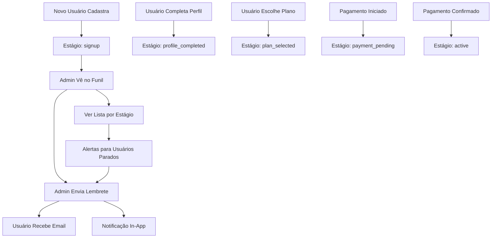

# Fase 2: Dashboard de Jornada do Cliente - Implementado

## ✅ Implementação Completa

### 1. Nova Tabela: `user_journey_tracking`

**Estrutura:**
- `id`: UUID (Primary Key)
- `user_id`: UUID (Foreign Key → auth.users)
- `journey_stage`: TEXT com CHECK constraint
- `stage_completed`: BOOLEAN
- `completed_at`: TIMESTAMP
- `metadata`: JSONB
- `created_at`: TIMESTAMP
- `updated_at`: TIMESTAMP

**Estágios da Jornada:**
1. **signup** - Cadastro inicial realizado
2. **profile_completed** - Perfil completo (CPF, nome, telefone)
3. **plan_selected** - Plano escolhido
4. **payment_pending** - Pagamento iniciado mas não confirmado
5. **payment_confirmed** - Pagamento confirmado
6. **active** - Usuário ativo com assinatura

**RLS Policies:**
- Admins podem ver e gerenciar todos os registros
- Edge Functions podem inserir registros
- Usuários comuns não têm acesso direto

### 2. Funções SQL Criadas

#### `update_user_journey_stage(p_user_id, p_new_stage, p_metadata)`
Atualiza o estágio da jornada do usuário:
- Valida o novo estágio
- Marca o estágio anterior como completo
- Cria novo registro com o estágio atual
- Registra log de atividade

#### `get_users_by_journey_stage(p_stage, p_limit, p_offset)`
Busca usuários filtrados por estágio (Admin only):
- Retorna usuários no estágio especificado ou todos
- Calcula horas no estágio atual
- Inclui informações do perfil (email, nome)
- Paginação configurável

#### `get_journey_funnel_stats()`
Retorna estatísticas do funil (Admin only):
- Quantidade de usuários por estágio
- Tempo médio em cada estágio
- Taxa de conclusão de cada estágio

### 3. Nova Página: `/admin/user-journey`

**Localização:** `src/pages/UserJourney.tsx`

**Componentes:**
- `UserJourneyDashboard` - Container principal com tabs
- `JourneyFunnel` - Visualização do funil de conversão
- `UserStageList` - Lista de usuários por estágio
- `SendReminderDialog` - Dialog para enviar lembretes
- `JourneyAnalytics` - Analytics e métricas

**Funcionalidades:**
✅ Funil de conversão visual com percentuais
✅ Tempo médio em cada estágio
✅ Taxa de conclusão por estágio
✅ Lista de usuários filtrada por estágio
✅ Alertas para usuários parados há muito tempo
✅ Botão "Enviar Lembrete" para cada usuário
✅ Templates de email pré-configurados
✅ Mensagens personalizadas

### 4. Edge Function: `send-journey-reminder`

**Localização:** `supabase/functions/send-journey-reminder/index.ts`

**Funcionalidade:**
- Verificação de autenticação do admin
- Envio de email via MailRelay API
- Criação de notificação in-app para o usuário
- Log de atividade do lembrete enviado

**Segurança:**
- Requer autenticação (verify_jwt = true)
- Verifica se o usuário é admin
- Valida dados antes do envio

**Templates de Lembrete:**
1. **Completar Perfil** - Para usuários no estágio "signup"
2. **Escolher Plano** - Para usuários com perfil completo
3. **Finalizar Pagamento** - Para usuários com pagamento pendente
4. **Mensagem Personalizada** - Template customizável

### 5. Integração Automática

**Modificação no `handle_new_user`:**
- Ao criar novo usuário, insere automaticamente estágio "signup"
- Mantém toda a lógica existente intacta
- Não afeta o fluxo de cadastro

**Como Atualizar Estágios:**
```sql
-- Via SQL
SELECT update_user_journey_stage(
  'user_id_here',
  'profile_completed',
  '{"has_cpf": true, "has_phone": true}'::jsonb
);

-- Via código (em hooks/components)
await supabase.rpc('update_user_journey_stage', {
  p_user_id: userId,
  p_new_stage: 'profile_completed',
  p_metadata: { has_cpf: true, has_phone: true }
});
```

## 🔄 Fluxo Completo



## 📊 Visualizações Disponíveis

### 1. Funil de Conversão
- Visualização gráfica com barras de progresso
- Percentual de usuários em cada estágio
- Tempo médio em cada fase
- Taxa de conclusão
- Click em cada estágio para filtrar usuários

### 2. Lista de Usuários
- Filtro por estágio específico ou todos
- Informações: nome, email, tempo no estágio
- Badge colorido com estágio atual
- Alerta visual para usuários parados (>48h)
- Botão "Enviar Lembrete" individual

### 3. Analytics
- Total de usuários no funil
- Taxa de conversão geral
- Tempo médio até ativação
- Quantidade de usuários necessitando atenção
- Análise detalhada por estágio:
  - Taxa de drop-off
  - Taxa de conclusão
  - Tempo médio
- Alerta especial para pagamentos pendentes

## 🎯 Como Usar

### Para Administradores:

1. **Acessar Dashboard:**
   - Ir para `/admin/user-journey`
   - Ou clicar em "Jornada do Cliente" na página de Gestão de Usuários

2. **Visualizar Funil:**
   - Tab "Funil de Conversão"
   - Ver quantos usuários em cada estágio
   - Identificar gargalos no processo

3. **Enviar Lembretes:**
   - Tab "Lista de Usuários"
   - Filtrar por estágio específico
   - Clicar em "Enviar Lembrete"
   - Escolher template ou personalizar mensagem
   - Confirmar envio

4. **Monitorar Analytics:**
   - Tab "Analytics"
   - Ver taxa de conversão geral
   - Identificar usuários necessitando atenção
   - Analisar performance por estágio

### Para Desenvolvedores:

**Atualizar Estágio da Jornada:**
```typescript
// Exemplo: Quando usuário completa perfil
const { error } = await supabase.rpc('update_user_journey_stage', {
  p_user_id: user.id,
  p_new_stage: 'profile_completed',
  p_metadata: {
    completed_via: 'profile_completion_modal',
    has_cpf: true,
    has_phone: true
  }
});
```

**Locais Sugeridos para Integração:**
- `useProfileCompletion.ts` - Quando perfil é completado
- `create-subscription` Edge Function - Quando plano é escolhido
- `asaas-webhook` - Quando pagamento é confirmado

## 🚀 Próximos Passos (Fase 3 e 4)

### Fase 3: Automação de Lembretes
- [ ] Criar Edge Function para lembretes automáticos
- [ ] Configurar Supabase Cron Job
- [ ] Lógica de envio baseada em tempo:
  - 24h sem completar perfil
  - 48h sem escolher plano
  - 72h com pagamento pendente

### Fase 4: Templates e Webhook MailRelay
- [ ] Edge Function centralizada `mailrelay-send-email`
- [ ] Templates HTML configuráveis
- [ ] Webhook para receber eventos do MailRelay
- [ ] Rastreamento de emails abertos/clicados

## 🧪 Como Testar

1. **Criar novo usuário:**
   - Fazer cadastro normal no portal
   - Verificar se aparece em "signup" no funil

2. **Enviar lembrete:**
   - Acessar `/admin/user-journey`
   - Ir para "Lista de Usuários"
   - Clicar em "Enviar Lembrete" em qualquer usuário
   - Escolher template
   - Verificar email recebido

3. **Atualizar estágio (manual via SQL):**
   ```sql
   SELECT update_user_journey_stage(
     (SELECT id FROM profiles WHERE email = 'teste@example.com' LIMIT 1),
     'profile_completed',
     '{}'::jsonb
   );
   ```

4. **Verificar notificação in-app:**
   - Login com usuário que recebeu lembrete
   - Verificar notificações no sistema

## 📈 Métricas Importantes

**KPIs a Monitorar:**
- Taxa de conclusão de perfil (signup → profile_completed)
- Taxa de seleção de plano (profile_completed → plan_selected)
- Taxa de finalização de pagamento (payment_pending → payment_confirmed)
- Taxa de conversão geral (signup → active)
- Tempo médio em cada estágio
- Quantidade de usuários parados há >48h

## ⚠️ Notas de Segurança

- ✅ RLS habilitado na tabela `user_journey_tracking`
- ✅ Apenas admins podem visualizar dados
- ✅ Edge Function requer autenticação
- ✅ Verificação de role admin antes de enviar lembretes
- ✅ Logs de auditoria para todas as ações

## 🔗 Links Úteis

- **Página:** https://mulheresemconvergencia.com.br/admin/user-journey
- **Edge Function Logs:** Dashboard Supabase → Functions → send-journey-reminder
- **Tabela no Banco:** `public.user_journey_tracking`
